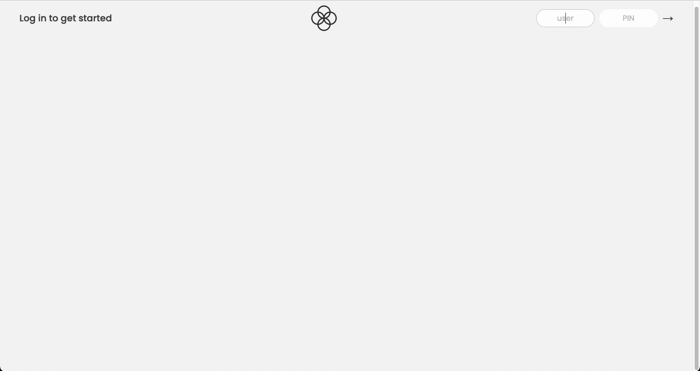

# Bankist

This is a project created by Jonas Schmedtmann for his course 'The Complete JavaScript Course 2023: From Zero to Expert!' in the UDEMY platform.

## Goals

- Consolidate array manipulation, using methods such as map, filter, reduce, some and findIndex.
- Practice chaining methods.
- Learn how to use the optional chaining operator.
- Consolidate DOM manipulation.
- Learn how to operate with Date object.
- Learn how to use internationalization API with numbers and dates.
- Practice setTimeout and clearInterval.

## DEMO

